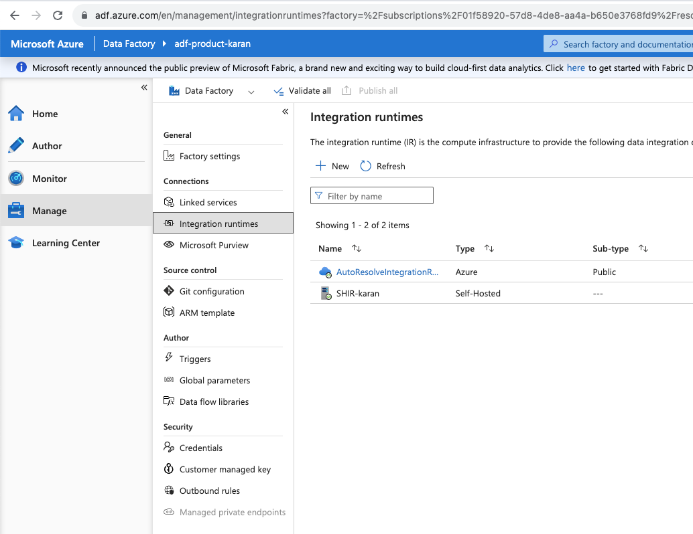
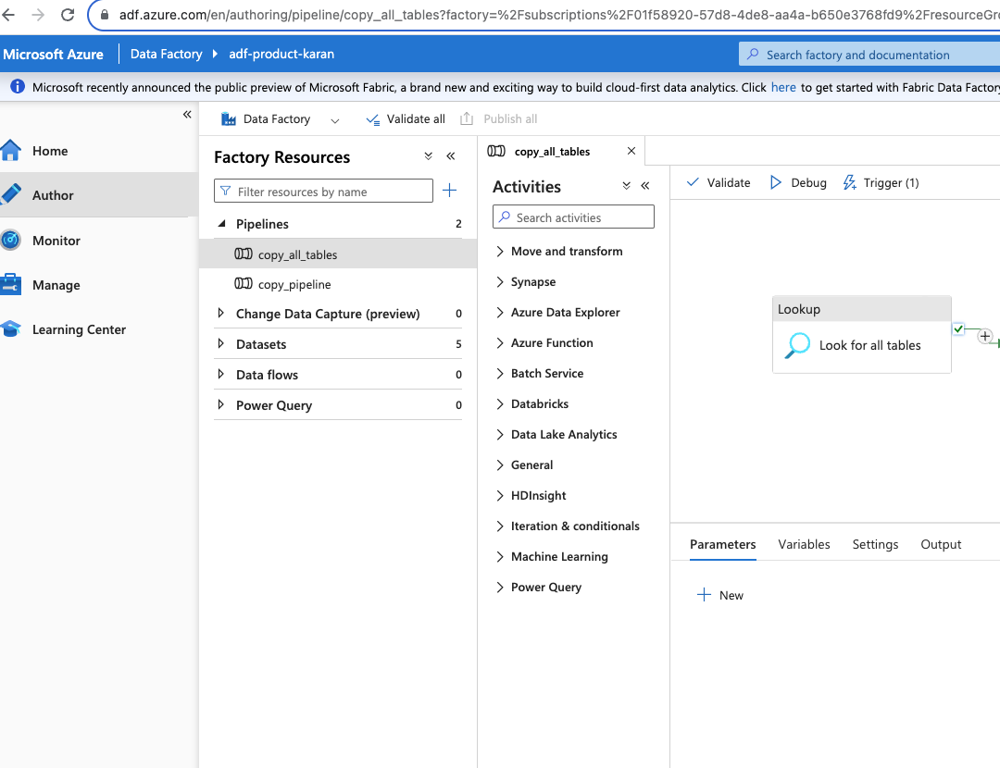
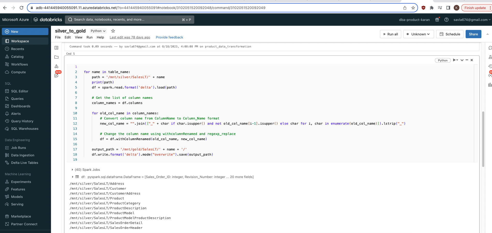

# Azure-Real-Time-Product-Performance-Insights-Project

<h2>Description</h2>
This project consist a simple data migration and real-time analytics process. It involves constructing an ETL pipeline to migrate an on-premises SQL Server database to the cloud while concurrently conducting real-time analytics to monitor and analyze product performance."
<br />


<h2>Services Used</h2>

- <b>Azure Data Factory</b> 
- <b>Azure Synapse Analytics</b>
- <b>Azure Databricks</b> 
- <b>Azure Data Lake Gen 2</b>
- <b>Azure Key Vault</b> 
- <b>Microsoft PowerBI</b>
- <b>Azure Active Directory</b> 

<h2>Project walk-through:</h2>

<p align="center">
PROJECT ARCHITECTURE: <br/>

<br />
<br />
AZURE RESOURCE GROUP:  <br/>

<br />
<br />
ON-PREMISE SQL SERVER DATABASE: <br/>

<br />
<br />
Establishing Connection between on premise SQL Server and Azure Cloud<br />
<br />Created login credential in SSMS and stored it in Azure Key Vault for secured access<br />

<br />
<br />
Installing Self Hosted Integration Runtime on the machine to connect Azure Data Factory with on-premise database
<br/>

<br />
<br />
CREATION OF A DYNAMIC PIPELINE IN AZURE DATA FACTORY TO FETCH ALL THE TABLES FROM ON PREMISE SQL DATABASE<br />
Using the LOOKUP Activity to fetch all the TABLE names and Schema name
<br />

<br />
Using the ‘For Each’ activity to get the data from all the tables and Store it in Azure Data Lake Gen 2 in the raw data (Bronze) folder. The data is stored in Parquet Format<br/>

<br />
<br />
DATA TRANSFORMATION IN DATABRICKS<br/>
<br/>I have performed two basic transformations in Pyspark. The main idea was to get used to the databricks platform.<br/>
<br/>Bronze Layer to Silver Layer: Transformed the date format to align with the UTC format, standardized it across all the attributes and converted the data into delta format.<br/>

<br />
Silver Layer to Gold Layer: Changing the nomenclature of the attributes to increase retrieval process and standardize across all tables.
<br/>

<br />
CONNECT THESE DATABRICKS NOTEBOOKS IN THE ADF PIPELINE<br/>

<br />
SQL DATABASE CREATION USING AZURE SYNAPSE ANALYTICS<br/>
Creating a Stored Procedure to dynamically create VIEW for each table.<br/>

<br />
<br />
Creating a pipeline to fetch the data from the transformed layer and create a serverless SQL database.
<br/>

<br />
<br />
POWER BI dashboard respresenting the performance insights real-time. To automate this and perform real-time processing I had scheduled triggers in ADF pipeline.
<br/>

<br />
</p>

<!--
 ```diff
- text in red
+ text in green
! text in orange
# text in gray
@@ text in purple (and bold)@@
```
--!>
